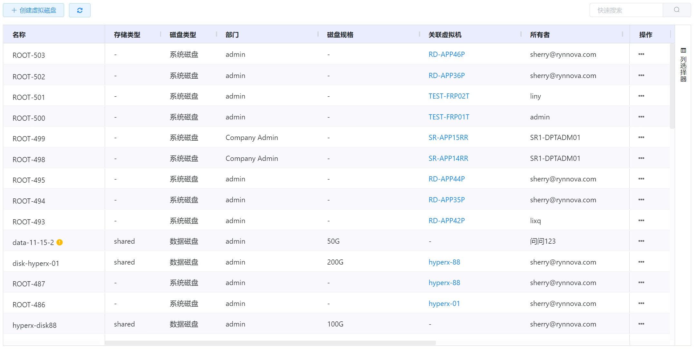

# 4.2.3.虚拟磁盘管理

云平台中的虚拟磁盘如同实际的物理硬盘一样，可以为虚拟机提供扩展使用的空间。每个虚拟机由安装了操作系统的系统磁盘和拓展存储空间的数据磁盘组成。

在“资源管理”菜单下选择左侧“虚拟机资源管理”的导航菜单，之后点击“虚拟磁盘”的子菜单，即可看到虚拟磁盘的管理界面：

虚拟磁盘可以为虚拟机提供存储功能，可分为“根磁盘”和“数据磁盘”：

- 根磁盘(ROOT DISK))：虚拟机的系统磁盘，用于支撑虚拟机的系统运行；

- 数据磁盘(DATA DISK)：虚拟机使用的数据磁盘，用于拓展虚拟机的存储。

虚拟磁盘的的状态有“已挂载”和“未挂载”两种：

- 已挂载：显示平台当前已经挂载在虚拟机上的虚拟磁盘列表；

- 未挂载：显示平台当前尚未挂载在虚拟机上的虚拟磁盘列表。

## 相关操作

HYPERX云管理平台支持用户对虚拟磁盘进行管理，支持的功能如下：

- 快速搜索：根据虚拟磁盘的名称、管理虚拟机、所有者等字段全局搜索虚拟磁盘；
- 快速筛选：支持根据虚拟磁盘的名称、存储类型、磁盘类型等字段进行高级筛选；
- 创建虚拟磁盘：在平台中创建一块虚拟磁盘；
- 单次备份：为选定的虚拟磁盘创建磁盘备份；
- 定时备份：未选定的虚拟磁盘创建定时备份；
- 挂载虚拟机：将处于“未挂载”状态的虚拟磁盘挂载到指定虚拟机上；
- 卸载虚拟磁盘：将选定的虚拟磁盘从虚拟机上卸载；
- 删除虚拟磁盘：删除选定的虚拟磁盘，若虚拟磁盘处于“已挂载”状态，需要将其从虚拟机上卸载；
- 调整磁盘容量：调整选定虚拟磁盘的磁盘规格。

操作入口如下：

- 资源管理→虚拟资源管理→虚拟磁盘

## 操作说明

### 创建虚拟磁盘

① 在虚拟磁盘管理界面中，点击“创建虚拟磁盘”按钮：

② 将会弹出“创建虚拟磁盘”的操作提示框，可以填写虚拟磁盘的相关信息，填写相关信息后，点击“确定”按钮，即可创建数据虚拟磁盘：

其中，磁盘规格分为自定义规格和定量规格两种：

- 自定义规格：根据设定的容量阈值范围自定义磁盘容量，最小单位为1GB；
- 定量规格：设定好磁盘容量的磁盘规格。

> *注：
>
> - 可以通过选择存储标识，定位到特定的一个或多个存储，缩小存储规格的选择范围；
> - 在此界面仅支持创建数据磁盘，系统磁盘会在创建虚拟机时自动创建；
> - 新建的虚拟磁盘状态为“未挂载”，支持挂载在所属部门的虚拟机上；
> - 新建的虚拟磁盘如果未初始化(未挂载至虚拟机)，不支持备份和定时备份。
>

### 单次备份虚拟磁盘

① 在虚拟磁盘管理界面中，选择需要单次备份的虚拟磁盘，在操作列中点击“单次备份”按钮：

② 将会弹出“单次备份”的操作提示框，填写相关信息后，点击“确定”按钮，即可为选定的磁盘创建备份：

> *注：
>
> - 若新建的虚拟磁盘未挂载过虚拟机，则处于未初始化状态，无法进行磁盘备份；
> - 若虚拟磁盘所关联虚拟机有快照或定时快照，则不支持创建磁盘备份；
> - 如需了解虚拟磁盘备份相关内容，请查阅磁盘备份管理章节。

###  定时备份虚拟磁盘

① 在虚拟磁盘管理界面中，选择需要定时备份的虚拟磁盘，在操作列中点击“定时备份”按钮：

② 将会弹出“定时备份”的操作提示框，填写相关信息后，点击“确定”按钮，即可为选定的磁盘创建定时备份：

> *注：
>
> - 可以选择根据小时、天、周或月的某一个时间点，系统将在该时间点自动为虚拟磁盘创建备份；
> - 若新建的虚拟磁盘未挂载过虚拟机，则处于未初始化状态，无法进行磁盘定时备份；
> - 备份保留数量即为定时备份的最大保留数量，系统将清理旧的定时备份，保存最新的定时备份；
> - 用户可以分别按小时、按天、按周、按月设置多个定时器，但每一类时间维度仅支持设置一个定时器；
> - 若虚拟磁盘所关联虚拟机有快照或定时快照，则不支持创建磁盘备份；
> - 如果按月设置定时备份，为保证系统稳定，每月日期不得超过28号。

### 删除虚拟磁盘定时备份

① 在虚拟磁盘管理界面中，选择需要删除定时备份的虚拟磁盘，在操作列中点击“定时备份”按钮：

② 将会弹出“定时备份”的操作提示框，选择需要删除的定时器，点击操作列的“删除”按钮：

③ 将会弹出“确认删除”的操作提示框，点击“确定”按钮，即删除选定的虚拟磁盘定时器：

> *注：
>
> - 若用户设置了多类时间维度的定时器，仅删除用户选择的那一条定时器记录；
> - 用户删除定时器后，之前平台依据定时器自动创建的定时快照不会受到影响。

### 挂载虚拟磁盘到虚拟机

① 在虚拟磁盘管理界面中，选择需要挂载到虚拟机上的虚拟磁盘，在操作列中点击“挂载到虚拟机”按钮：

② 将会弹出“挂载虚拟机”的操作提示框，选择需要挂载的虚拟机后，点击“确定”按钮，即可将选定的磁盘挂载到指定虚拟机上：

> *注：
>
> - 
>   拥有快照或定时快照的虚拟机不支持挂载虚拟磁盘，将会置灰显示在选项框的底部。
>

### 将虚拟磁盘从虚拟机上卸载

① 在虚拟磁盘管理界面中，选择需要从虚拟机上卸载的虚拟磁盘，在操作列中点击“卸载”按钮：

② 将会弹出“卸载磁盘”的操作提示框，复核信息无误后，点击“确定”按钮，即可将虚拟磁盘从虚拟机上卸载：

> *注：
>
> - 
>   由于虚拟机的系统磁盘用于安装操作系统，若卸载系统磁盘虚拟机将无法正常运行，所以平台不支持卸载系统磁盘；
>
> - 拥有快照的虚拟机不支持卸载虚拟磁盘。
>

### 调整虚拟磁盘容量

① 在虚拟磁盘管理界面中，选择需要调整容量的磁盘，在操作列中点击“调整磁盘容量”按钮：

② 将会弹出“调整磁盘容量”的操作提示框，对于数据磁盘和系统磁盘，系统提供了不同的“调整磁盘容量”方案；选择新的存储方案并选择磁盘大小后，点击“确定”按钮，对磁盘进行扩容：

- 系统磁盘的容量调整：

> *注：
>
> - 系统磁盘容量支持自定义输入，且磁盘容量的最小单位为1GB；
> - 调整系统磁盘容量时，为保证虚拟机能够正常启动，仅支持扩容操作，不支持缩容操作。

- 数据磁盘的容量调整

  - 非自定义的磁盘规格：

  

  - 自定义的磁盘规格：

  

> *注：
>
> - 调整数据磁盘容量时，新磁盘规格的磁盘类型需要与当前类型一致；
> - 调整数据磁盘容量时，为保障数据磁盘业务，仅支持扩容操作，不支持缩容操作。

### 删除虚拟磁盘

① 在虚拟磁盘管理界面中，选择需要删除的虚拟磁盘，在操作列中点击“删除”按钮：

② 将会弹出“确认删除”的操作提示框，点击“确定”按钮，即可删除选定的虚拟机磁盘：

> *注：
>
> - 仅支持删除“未挂载”状态的虚拟磁盘；
> - 若磁盘创建了磁盘备份，则该磁盘不支持被删除。