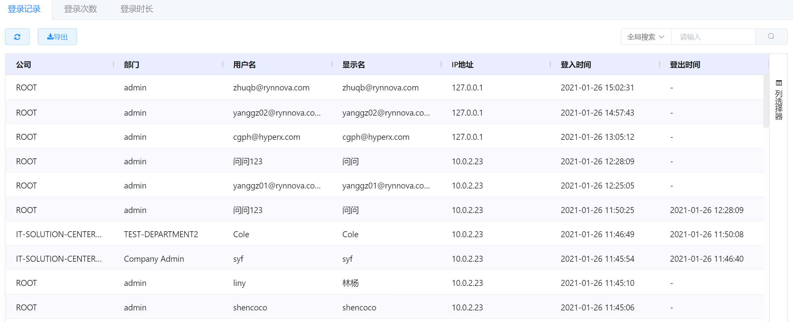
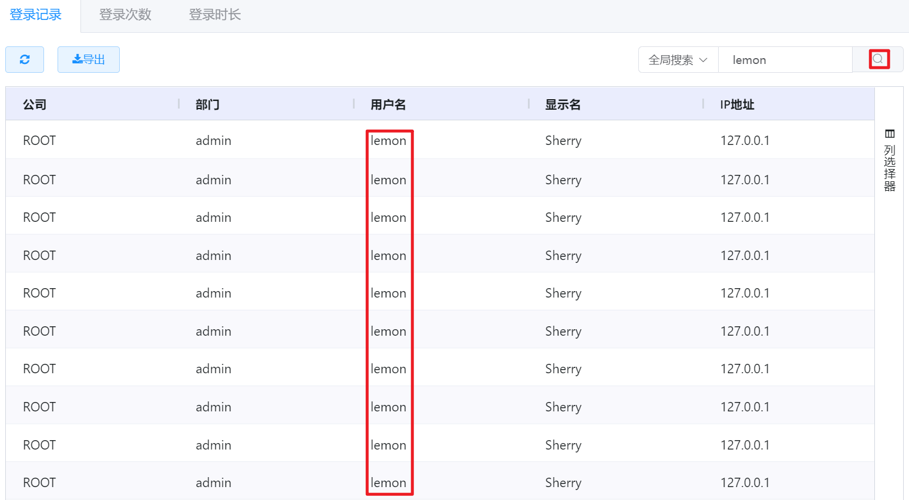
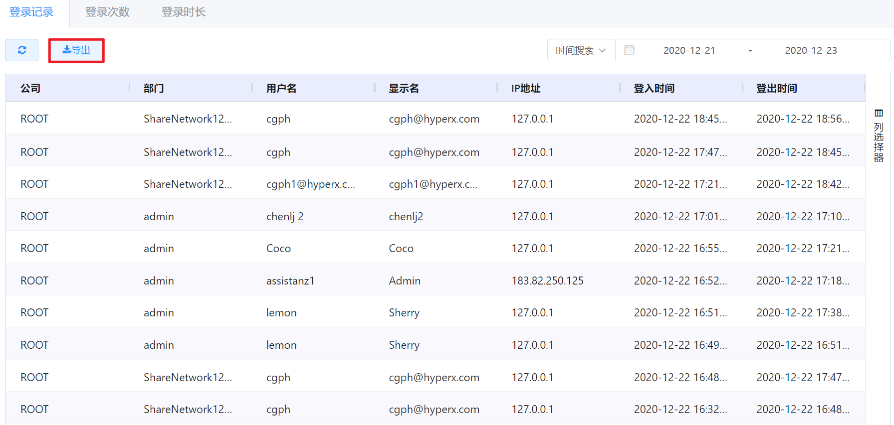
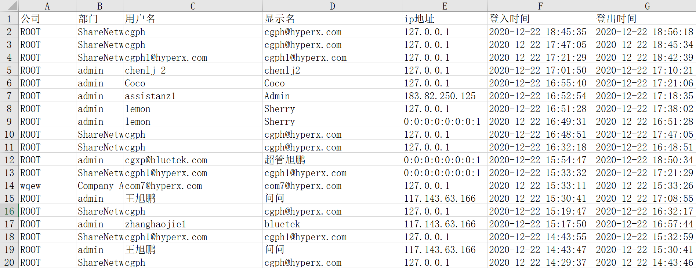

# 6.3.用户报表

超级管理员、业务管理员、部门管理员可以查看所辖范围内用户的登录情况，包括用户的登录记录、次数和在线时长。

在“运营中心”菜单下选择左侧“用户报表”的导航菜单，即可看到费用统计管理界面：

> *注：
>
> - 超级管理员可以看到平台中全部用户的登录报表情况；
> - 业务管理员可以看到所管辖用户用户的登录报表情况；                                               
> - 部门管理员可以看到部门内全部用户的登录报表情况。

## 相关操作

HYPERX云管理平台支持超级管理员、业务管理员和部门管理员查看所管辖组织的用户报表，支持的功能如下：

- 全局搜索：根据登录用户名、显示名等字段全局搜索登录记录、登录次数或登录时长；
- 公司搜索：根据所在的组织搜索该组织下用户的登录记录、登录次数或登录时长；
- 时间搜索：根据选定的时间区间筛选需要查看的登录记录、登录次数或登录时长；
- 导出报表：将选定条件下的登录记录、登录次数或登录时长报表以XLSX的格式导出到本地。

操作入口如下：

- 运营中心→用户报表

## 操作说明

### 全局搜索

① 在用户报表的管理界面中，点击需要查看的统计项选项卡(如登录记录、登录次数或登录时长)，选择“全局搜索”筛选器：

② 在搜索框中输入用户登录记录的用户名、显示名、IP地址等字段的关键字，点击“搜索”按钮，即可筛选出搜索结果：

### 公司搜索

① 在用户报表的管理界面中，点击需要查看的统计项选项卡(如登录记录、登录次数或登录时长)，选择“公司搜索”筛选器：

② 在搜索框中选择组织后，即可筛选出搜索结果：

### 时间搜索

① 在用户报表的管理界面中，点击需要查看的统计项选项卡(如登录记录、登录次数或登录时长)，选择“时间搜索”筛选器：

② 在日期选择器中选择需要搜索登录报表的时间区间：

③ 即可筛选出所选时间区间的搜索结果：

> *注：
>
> - 时间搜索是根据用户登出平台的时间进行统计的；
> - 如果时间选择器中的起始时间和终止时间选择的同一天，筛选出的即为当天的登录报表；
> - 如需清除筛选项，可以点击终止时间右侧的清除按钮。

### 导出报表

① 在用户报表的管理界面中，点击需要查看的统计项选项卡(如登录记录、登录次数或登录时长)，点击“导出”按钮：

② 即可将报表以XLSX的格式保存在本地，打开XLSX文件，效果如下：

> *注：
>
> - 导出的报表文件即为当前筛选条件下的全部数据，如果没有进行筛选，则默认导出全部数据。

