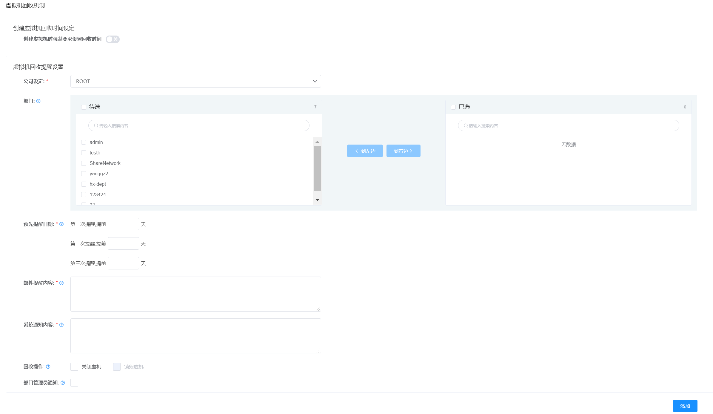
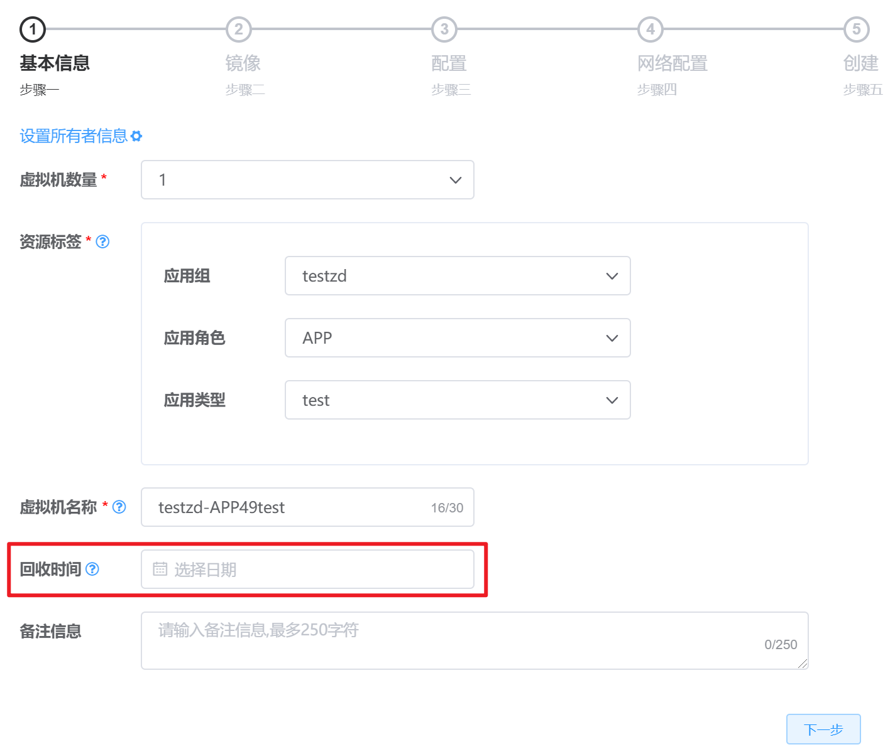
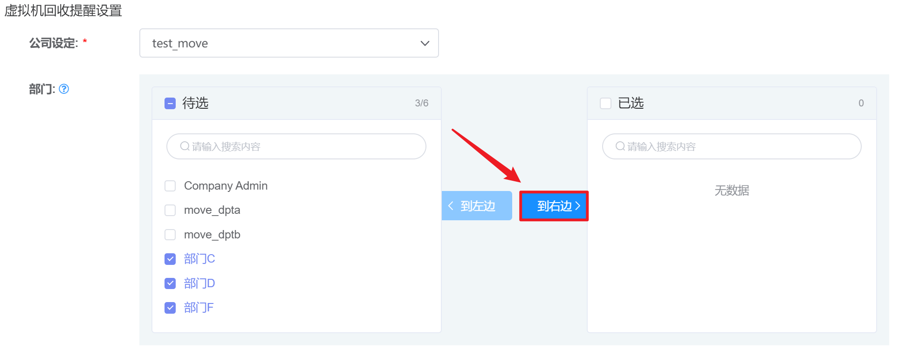
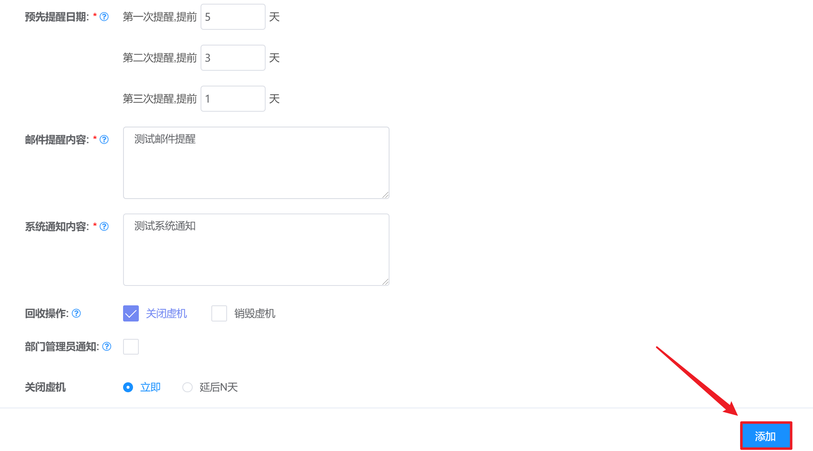
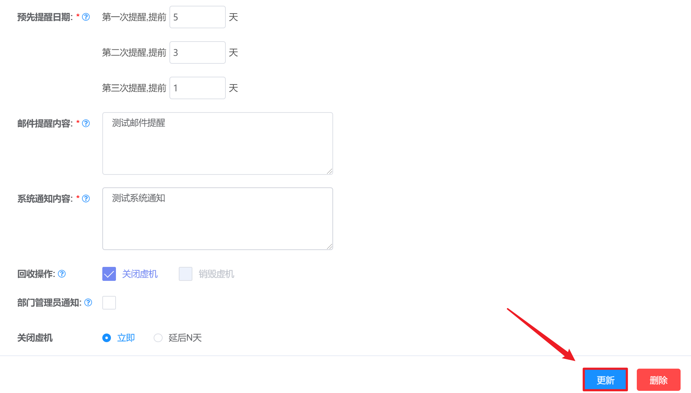
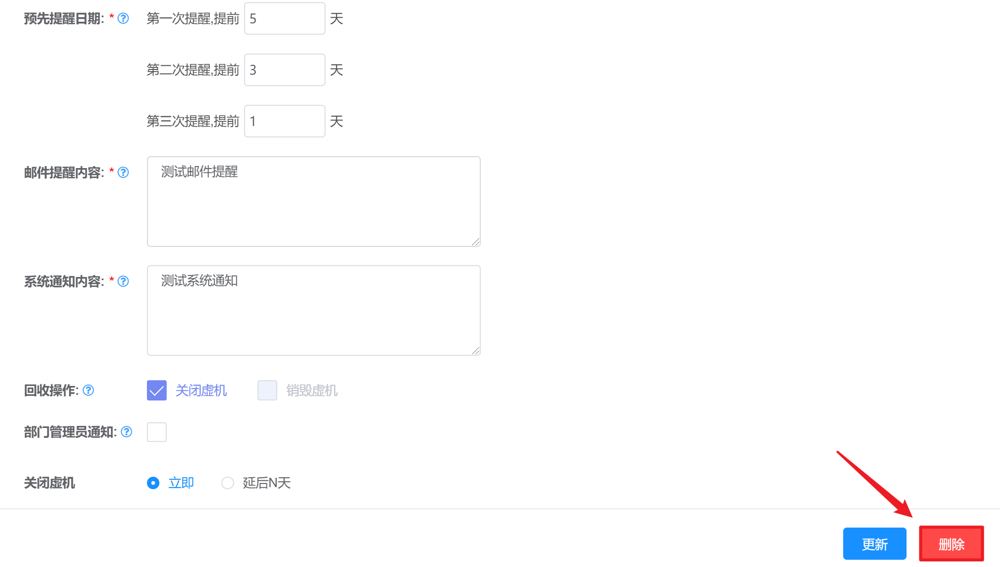

# 7.3.1.虚拟机回收机制管理

云平台支持管理员配置各个组织下虚拟机的回收机制，包括提醒时间、通知内容和到期时对虚拟机执行的操作。

在“系统设置”菜单下选择左侧“系统管理”的导航菜单，之后点击“虚拟机回收机制”的子菜单，即可看到虚拟机回收机制的管理界面：

## 相关操作

HYPERX云管理平台支持超级管理员对底层数据进行管理，支持的功能如下：

- 启用虚拟机回收时间：启用后，平台用户创建虚拟机时强制要求用户输入回收时间；
- 禁用虚拟机回收时间：禁用后，平台用户创建虚拟机时不强制要求用户输入回收时间；
- 创建虚拟机回收机制：选择公司和部门，并为选定组织创建虚拟机回收机制的相关信息；
- 编辑虚拟机回收机制：选择公司和部门，编辑选定组织创建虚拟机回收机制的相关信息；
- 删除虚拟机回收机制：选择公司和部门，删除选定组织创建虚拟机回收机制的相关信息；

操作入口如下：

- 系统设置→资源提醒&回收→虚拟机回收机制

## 操作说明

### 启用虚拟机回收时间

① 在虚拟机回收机制管理界面，创建虚拟机回收时间设定的菜单中，点击“创建虚拟机时强制要求设置回收时间”的启用按钮，强制要求平台用户在创建虚拟机时填写回收时间：

② 启用后，进入资源管理→虚拟机资源管理→虚拟机的菜单中，执行创建虚拟机的操作；

③ 可见“回收时间”字段变为必填项：

### 禁用虚拟机回收时间

① 在虚拟机回收机制管理界面，创建虚拟机回收时间设定的菜单中，点击“创建虚拟机时强制要求设置回收时间”的禁用按钮，不强制要求平台用户在创建虚拟机时填写回收时间：

② 禁用后，进入资源管理→虚拟机资源管理→虚拟机的菜单中，执行创建虚拟机的操作；

③ 可见“回收时间”字段变为选填项：

### 创建虚拟机回收机制

① 在虚拟机回收机制管理界面中，选择需要创建回收机制的组织后，点击“到右边”按钮，选择相应的部门：

② 设置预先提醒的日期、邮件、推送的通知后，选择虚拟机到期回收的操作信息后，点击“添加”按钮：

③ 即可为选定的部门配置虚拟机回收的机制。

> *注：
>
> - 如果勾选“部门管理员通知”复选框，部门成员虚拟机到期前和逾期时，会给部门管理员发送邮件通知；
> - 虚拟机到期前，将会按照“预先提醒日期”设置的时间给虚拟机所有者发送邮件通知；
> - 如果勾选“关闭虚拟机”(或“销毁虚拟机”)的回收操作，需要勾选处理时间，如果选择“延后N天”，需要配置延后的天数；

### 编辑虚拟机回收机制

① 在虚拟机回收机制管理界面中，选择需要编辑回收机制的组织后，可以选择或取消采用该回收机制的部门；

② 支持编辑设置预先提醒的日期、邮件通知、回收操作等信息，编辑后，点击“更新”按钮：

③ 即可编辑选定组织的虚拟机回收机制。

### 删除虚拟机回收机制

① 在虚拟机回收机制管理界面中，选择需要删除回收机制的组织后，点击“删除”按钮：

② 即可删除选定组织的虚拟机回收机制。

> *注：
>
> - 删除选定组织的虚拟机回收机制后，该组织下用户的虚拟机将不再遵循该机制对虚拟机进行处理。