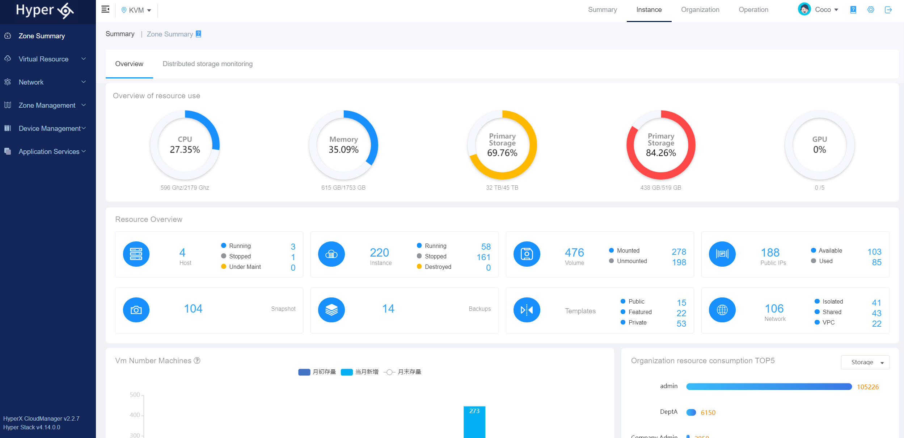
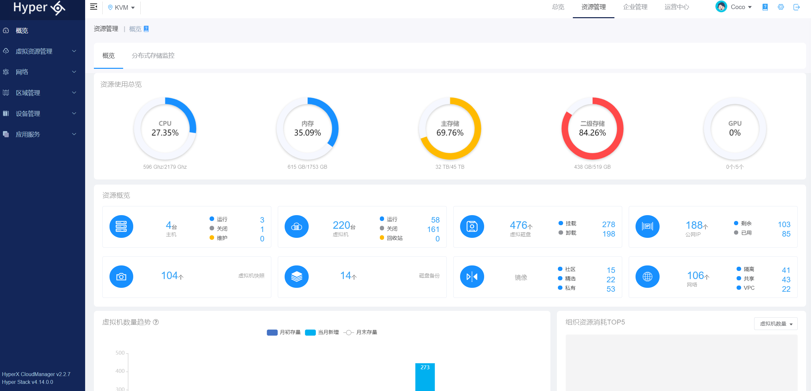

# 8.1.个人设置

用户可以配置平台语言偏好、修改个人信息、调试API接口、使用旧云平台版本和查看平台版本信息。

## 相关操作

HYPERX云管理平台支持用户配置个人设置，支持的功能如下：

- 语言偏好：用户可以选择云平台显示的默认语言，支持中文或英文；
- 个人设置：支持用户修改头像、个人信息、密码，查看API信息；
- 调试API接口：支持查看API接口文档，输入API密钥调试调用平台提供的API接口；
- 回到旧版：支持用户进入旧云平台版本的入口；
-  查看平台版本号：支持用户查看当前云平台版本的版本号 。

操作入口如下：

- 云平台右上角个人头像(用户名)处

## 操作说明

### 设置语言偏好

云平台支持中文和英文，用户可以选择两种语言中的任何一种作为系统语言，本节将介绍默认语言的选择。

① 点击云平台右上角个人头像(用户名)处的菜单，选择“English”：

② 即可设置云平台默认语言为英文：

③ 点击云平台右上角个人头像(用户名)处的菜单，选择“中文”：

④ 即可设置云平台默认语言为中文：

### 个人设置

① 点击云平台右上角个人头像(用户名)处的菜单，选择“个人设置”菜单：

② 将会进入个人设置的页面，修改相关信息后点击“保存”按钮，即可配置用户个人信息：

> *注：
>
> - 用户头像：用户可以点击头像，上传用户头像，用户头像尺寸须小于25*25像素，大小须小于1MB；
> - 个人信息：用户可以修改用户名、邮箱、显示名等信息，修改完成后点击“保存”按钮更新个人信息；
> - 用户的公司、部门和角色不支持在“个人设置”中进行修改，只支持查阅；
> - 用户输入的密码应至少包含一个大写字母、一个数字和一个特殊字符且不小于8位；
> - 若为该用户启用API功能，则该用户可以查看API密钥和Secret密钥用于调试API接口文档；
> - 如需开启用户API，查阅用户管理章节。

### 调试API接口

云平台支持为用户使用API文档调试API接口，本节将介绍API接口的类型及基本使用方法。

① 点击云平台右上角个人头像(用户名)处的菜单，选择“API”菜单：

② 即可进入API的调试接口界面：

③ 选择需要进行调试的API，点击“Expand Operations”按钮，将会弹出该API的详情列表：

④ 依据API的规范用例填写相应的调试参数后，点击“Try it out！”按钮：

⑤ 可获取调用API的返回值。并且可以根据表格下方提供的结果参考判断调用的结果：

API的详情链表由规范用例、调试参数和结果参考组成。

- 规范用例：显示调用该API的请求头示例；
- 调试参数：输入调用该API的参数、用户的API密钥和Secret密钥；
- 结果参考：显示返回值对应的结果参考，用户可以通过返回值判断调用API的问题和结果。

### 回到旧版

① 点击云平台右上角个人头像(用户名)处的菜单，选择“回到旧版”菜单：

② 即可进入旧云平台版本的登录界面：

### 查看平台版本号

在左侧导航栏底部，即可看到云平台的版本号信息：

