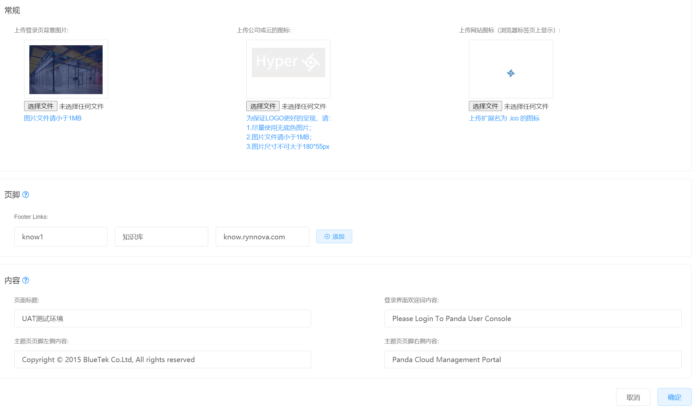
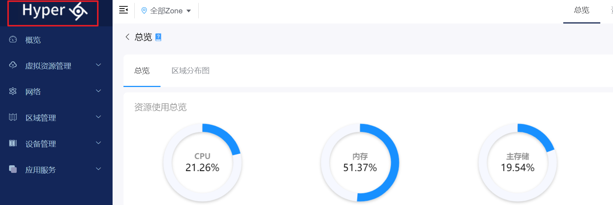
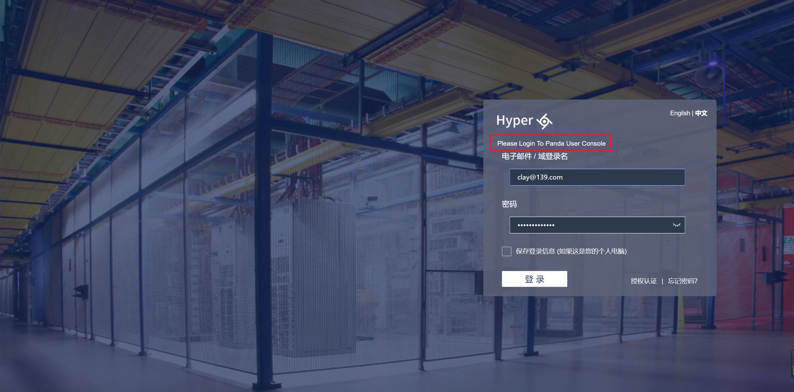

# 7.2.1.界面配置管理

在“系统设置”菜单下选择左侧“平台系统配置”的导航菜单，之后点击“界面配置”的子菜单，即可看到界面配置的管理界面：

## 相关操作

HYPERX云管理平台支持超级管理员对云平台的界面进行管理，支持的功能如下：

- 常规配置：支持自定义登录背景图、产品徽标和浏览器标签图；
- 页脚配置：支持自定义云平台页脚的内容链接；
- 内容配置：支持自定义云平台的页面标题、登录页面欢迎词和主题页内容。
- 公告配置：支持自定义平台内部公告信息通知，将会在在页面顶部高亮展示至平台所有用户；

操作入口如下：

- 系统设置→平台系统配置→界面配置

## 操作说明

### 常规配置

在界面配置的管理界面中，点击“选择文件”按钮自定义登录背景图、产品徽标和浏览器标签图：

① 登录背景图、公司或云徽标将会显示在登录界面：

② 公司或云徽标同时会显示在左侧导航栏的顶部：

③ 浏览器标签图将会显示在浏览器标签左侧：

> *注：
>
> - 登录背景的图片的文件必须小于1MB；
> - 产品或品牌徽标的分辨率必须小于180*55，文件大小必须小于1MB；
> - 页面图标的拓展名为.ico。

### 页脚配置

在界面配置的管理界面中，可以编辑云平台页脚，该内容显示在平台底部页脚的正中：

其中，三个输入框分别代表显示的英文页脚、显示的中文页脚，和点击页脚跳转的超链接。

页脚将会显示在平台底部页脚的正中：

> *注：
>
> - 需要填写的内容分别是“英文状态下显示的内容”、“中文状态下显示的内容”和“内容所链接的URL”；
> - 如果设置多个页脚，系统将会根据用户所设置的顺序以“|”为分隔线依次显示。

### 内容配置

在界面配置的管理界面中，可以编辑云平台页面标题、登录页欢迎词、主题页脚内容，编辑后点击“保存”按钮即可修改：

① 页面标题将会显示在浏览器页面上：

② 登录界面欢迎词内容显示在用户的登录页面：

③ 主题页页脚的左、右侧内容分别显示在页脚的左右两侧：

